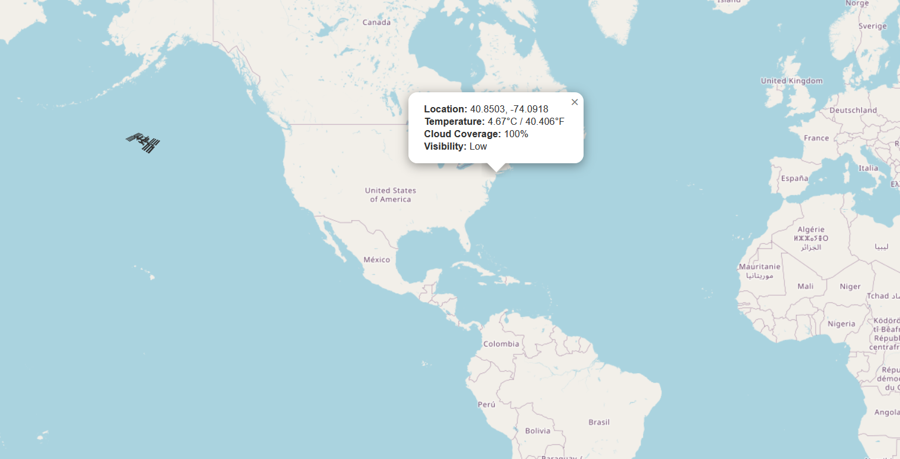

SkyPulse

SkyPulse is a personal project I built to track the International Space Station (ISS) and display live weather
data anywhere on Earth. It combines a simple ETL pipeline with a Flask web app and an interactive map. The goal was to
make something that shows what’s happening above us in real time — both the ISS orbit and the local weather below it.

What It Does

Tracks the current position of the ISS using live API data.
Checks the weather and cloud coverage at any clicked location.
Calculates visibility conditions for ISS sightings.
Lets users subscribe with their email for ISS alerts.
Displays all of this through an interactive Leaflet map and dashboard.

How to Run It

1. Clone this repository to your computer.
2. Install the required dependencies by running:
pip install -r requirements.txt
3. Initialize the database with:
python -c "from database import init_db; init_db()"
4. Add your OpenWeatherMap API key.
In the file weather_helpers.py, replace the line that says:
API_KEY_OPENWEATHER = "your_api_key_here"
with your actual API key from openweathermap.org.
5. Run the ETL pipeline with:
python Main.py
6. Start the Flask web app with:
python app.py
7. Open your browser and go to http://127.0.0.1:5000 to display the dashboard

Features

The Home Page lets you subscribe to email updates.
The Map Page shows live weather — click anywhere to get the temperature, cloud coverage, and visibility for that spot.
The Data Page lists recent ISS position entries from the database.

Email Alerts

In email_alerts.py, update the following lines with your own email info:
SENDER_EMAIL = "your_email@example.com

Deploying
I used PythonAnywhere to deploy this because it is a free to use and easy to deploy site just to get my app
out on a platform for a online preview.

About

I built SkyPulse as a project to learn more about working with APIs,
ata pipelines, and Flask web apps. I wanted to create something hands-on that would
actually teach me how everything connects together while also being fun to build.

The idea came from my son, who has always been fascinated by space and dreams of becoming
an astronaut. This project became a way for us to explore that interest together, watching the
International Space Station move across the sky and seeing what the weather looks like below it.
It’s a mix of learning, curiosity, and something we can both enjoy.
